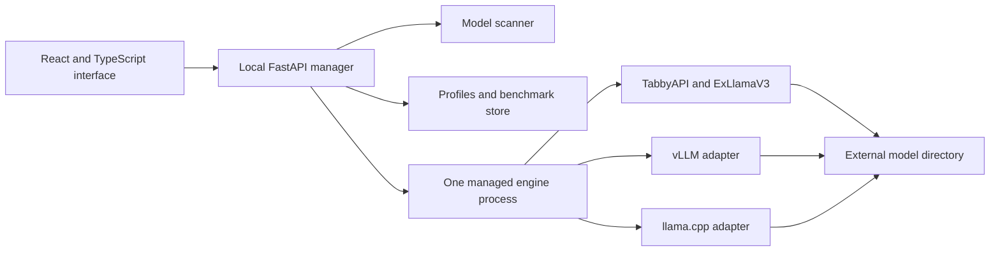

# Linux LLM Loader · analysis and implementation plan

This document records the product and engineering decisions without publishing workstation-specific paths, hardware identifiers, saved profiles, prompts, or benchmark history.

## Goals

Lumen should make large local models approachable while preserving the controls that materially affect speed and memory:

- select a model and compatible inference engine;
- configure at least a 262,144-token context window;
- prefer an 8-bit KV cache, with FP16 and 4-bit alternatives where supported;
- enable vision for multimodal checkpoints;
- enable multi-token prediction (MTP) and choose a small draft length;
- choose answer length and a practical CPU expert share;
- show prompt-processing speed and decode speed separately;
- show GPU/CPU power, VRAM/RAM use, CPU load, and first-token delay;
- save, edit, copy, delete, and restore profiles;
- provide a familiar streaming chat with screenshot paste and reliable tail following.

The first model trial uses approximately 3-bit EXL3 checkpoints. Higher-precision variants can be added after speed, memory use, long-context behavior, vision, and output quality are measured locally.

## Engine decision

### ExLlamaV3 through TabbyAPI

This is the qualified first engine because it directly supports the selected EXL3 checkpoints, CPU expert offload, quantized KV cache, vision, and checkpoint-provided prediction components. TabbyAPI supplies streaming and model lifecycle endpoints, so Lumen does not need to implement an inference scheduler.

The runtime is isolated from the system Python installation. Setup pins the ExLlamaV3 wheel, PyTorch CUDA build, TabbyAPI revision, and dependency list. It performs a real CUDA calculation before declaring installation complete.

### vLLM

The adapter is useful for supported native safetensors checkpoints, especially GPU-friendly FP4 or NVFP4 formats. It remains unavailable until its runtime and the selected architecture are qualified together. EXL3 files are not interchangeable with vLLM weights.

### llama.cpp

The GGUF adapter provides a compatibility and comparison path for existing GGUF models. It remains unavailable until a Linux `llama-server` path is configured and the model/projector combination passes the same acceptance checks.

## Model priorities

1. **Qwen Flash Next EXL3 around 3.05 bpw:** primary speed candidate with vision and MTP.
2. **DeepSeek Flash 0731 EXL3 around 3.04 bpw:** text-only exception, with CPU expert placement tuned for available memory bandwidth.
3. **DeepSeek Flash Vision experimental EXL3 around 3.04 bpw:** multimodal DeepSeek candidate.
4. **GLM Flash:** evaluate only if a local trial reaches the desired interactive speed; do not add model-specific complexity without that evidence.

Model names in the library come from checkpoint metadata and folder names. The model root is supplied during setup and stored only in the user's private configuration.

## User interface

The application uses a three-part desktop layout:

```text
┌─────────────────────────────────────────────────────────────────────────┐
│ GPU W · CPU W · VRAM · RAM · CPU load · prompt tok/s · decode tok/s    │
├─────────────────┬──────────────────────────────────┬────────────────────┤
│ Model library   │ Model details and conversation   │ Run settings       │
│ Search          │                                  │ Engine             │
│ Local models    │ Streaming response               │ Context / KV       │
│ Saved profiles  │                                  │ Vision / MTP       │
│ Benchmarks      │ Message or pasted screenshot     │ CPU share / answer │
└─────────────────┴──────────────────────────────────┴────────────────────┘
```

Visual hierarchy comes from spacing, type, restrained green and indigo accents, and clear state colors. The interface avoids dense expert settings. Unsupported choices are disabled or explained before a lengthy load begins.

The visible controls are limited to engine, context, KV precision, vision, MTP, draft tokens, answer limit, CPU expert share, CPU threads, prompt chunk size, temperature, and thinking mode. Settings that affect loading use **Apply and reload**; request-only settings take effect on the next message.

## Architecture



The manager does not import CUDA engines. It validates a small common settings model, translates it into engine-native arguments/configuration, starts one process group, waits for a health response, streams generation, records measurements, and terminates only processes it owns.

Each engine adapter follows the same small contract:

`probe → capabilities → validate → build launch → health → stream → metrics → stop`

Capability decisions belong to the combination of engine version, architecture, checkpoint format, vision component, and attention backend. A generic statement such as “the engine supports Q4” is not enough to enable a control for every model.

## Context, memory, and speed

“256K context” means 262,144 total tokens, including instructions, conversation, image tokens, and the reserved answer. Launching with that maximum proves allocation capacity; it does not prove correct retrieval near the limit. Qualification therefore includes an actual near-capacity request.

Model weight precision and KV precision are separate choices. A 3-bit checkpoint can still use Q8 KV. Recurrent state, small indexer state, vision components, and MTP components may retain native precision when required by the engine.

Unused VRAM is useful only when a bottleneck can move to it. Lumen exposes CPU expert share because moving more experts to the GPU can help when transfer and CPU execution dominate, but it can hurt if it reduces cache/workspace headroom. Changes are accepted only after repeated, matched benchmarks.

Report prompt processing and decode separately. Also record first-token delay, cache hits, draft acceptance, RAM/VRAM peaks, context, KV mode, CPU share, engine version, and checkpoint identity. Compare uncached prompts after warm-up and keep near-full-context measurements separate from short-prompt results.

## Installation design

The public repository contains no machine path. Setup accepts `--model-dir`, and optionally `--runtime-dir` and `--mount-device`. These values are written with owner-only permissions to `~/.config/lumen/config.json`.

The production frontend is committed, so a normal installation needs no Node.js toolchain. The installer:

1. validates x86_64 Ubuntu and NVIDIA access;
2. installs missing basic system tools;
3. bootstraps a private Python 3.12 with `uv`;
4. creates isolated manager and inference environments;
5. verifies pinned downloads and applies the local TabbyAPI patch;
6. performs a CUDA smoke test;
7. writes private configuration and the desktop shortcut.

Models remain where the user placed them. The runtime defaults to the Linux home filesystem because Python environments and thousands of small package files behave better there than on many removable or Windows-formatted drives.

## Security and privacy

All HTTP services bind to loopback. Cross-site management calls and remote image fetching are rejected. Engine credentials are random per run, stored in owner-only files, and redacted from application logs.

Git excludes:

- machine configuration and absolute paths;
- model files and download receipts;
- profiles, benchmark databases, prompts, output excerpts, and engine logs;
- generated CUDA/hardware reports;
- runtime environments, caches, `.env` files, and private-key files.

Documentation uses placeholders and general capacity requirements. Machine-generated validation reports require manual redaction before publication.

## Acceptance gates

### Installation

- A clean supported Ubuntu machine can install without a Codex runtime or system CUDA toolkit.
- Setup stops with a useful error when NVIDIA access, disk space, models, or required architecture are unavailable.
- Moving the source or model folder requires only rerunning setup.

### Inference

- The engine reports the requested context and KV precision.
- Text and supported image requests stream correctly.
- MTP loads only when compatible weights exist.
- Stop, unload, crash recovery, and model switching leave no orphan engine process.

### Experience

- The complete select → configure → load → chat → benchmark → save flow requires no file editing.
- Chat follows the tail until the user scrolls away.
- Screenshot paste and image validation work consistently.
- Profiles are easy to create, edit, copy, delete, undo, and restore.
- Missing power sensors or engine timing data appear as unavailable, never as invented values.

### Performance

- Use several representative prompts, generate enough output to reach steady decode, and report median plus range.
- Distinguish cold model startup, warm engine with empty KV cache, and near-full-context behavior.
- Never claim a target by disabling required vision, reducing context, counting cache hits as fresh input, or silently changing quantization.
